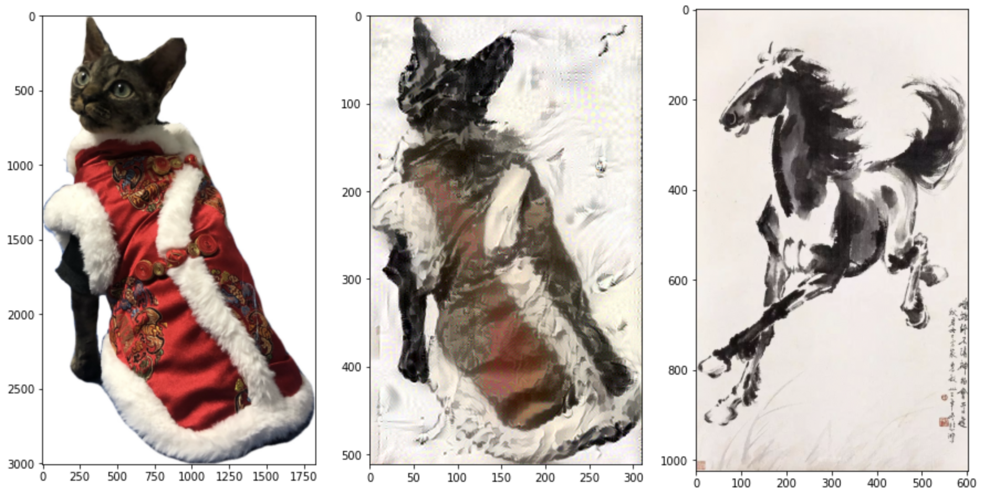

# Neural-Style-Transfer

## Introduction
The project in this repository is to use Neural Style Transfer which was first published in the paper "A Neural Algorithm of Artistic Style" by Leon Gatys et al. to generate artwork.

### Artwork demo
Sydney Opera Hourse + The Starry Night(by Vincent van Gogh)

Cat + Galloping Horse(by Xu Beihong徐悲鸿)

